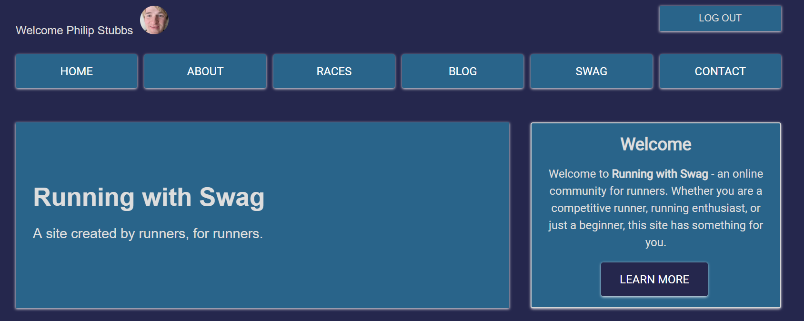
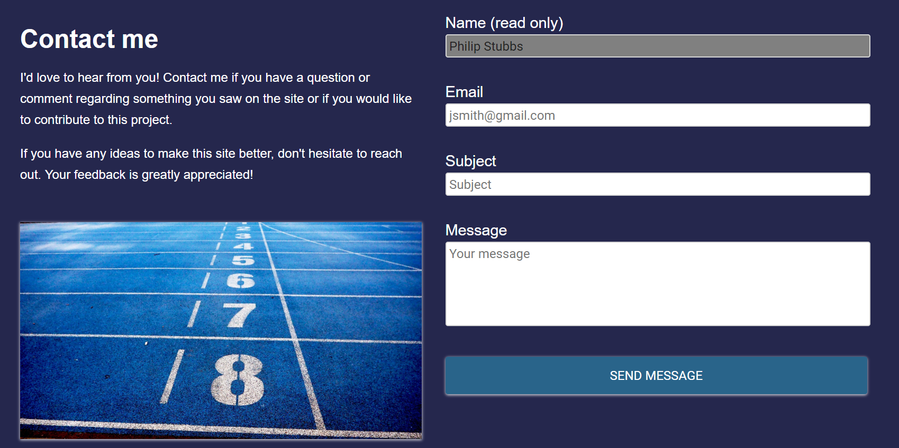

# Running with Swag

Running with Swag is an online community created by runners, for runners. Whether you are a competitive runner, running enthusiast, or just a beginner, this site has something for you.

## Table of contents

* [Live](#live)
* [Screenshots](#screenshots)
* [About this project](#about-this-project)
  * [How the app is built](#how-the-app-is-built)
  * [App workflow](#workflow)
  * [Structure of the project](#project-structure)
* [Getting started](#getting-started)
* [Deploying the app](#deployment)
* [Technologies used to create app](#technologies-used)
  * [Back end technologies](#Backend)
  * [Front end technologies](#Frontend)
* [Direction for future development](#future)
* [Issues](#Issues)

## Live

<https://running-with-swag.firebaseapp.com>

##  Screenshots

### Login page

### Home page

 

 

### About page

### Races page

 

 

### Blog page

 

### Swag page

 

### Contact page

##  About this project

I created this site because I love to run. Running is my passion. Running has been a big part of my life ever since I was a kid. In 2018, I started to train and run competitively in different short distance (3-6 mile) races. My ultimate goal is to train my way up to running and finishing a marathon.

I not only created this site to share my running adventures and experiences, but I also want to create an online community for runners to learn more about different running topics, find out about upcoming running events, and just have a place where runners can come together to share and exchange information with one another.

I graduated from the University of Minnesota Full Stack Web Development program in May 2018, and I have been wanting to create a site like this for quite some time now. Now that I have graduated, I thought now would be a good time to start it up. This site's development will be ongoing and open source. So, if you are a runner and/or web developer and would like to contribute, let's get in touch.

###  How the app is built

On the front end side, this project is built using React, which is an open-source Javascript library developed at Facebook specifically for the task of developing user interfaces. React relies on a component-based architecture where elements of the user interface are broken into small chunks of code called components. PrimeReact is a UI component framework for React that helps with building these components. Also, The web pages are designed using the css grid layout system

On the back end side, this project is a Node.js app. The app uses Firebase Authentication with a Google sign-in method to authenticate users with the app. Firebase Realtime Database is used to store the race stories users provide on the Races page as well as store messages from the Contact form. Firebase Hosting is used to deploy and host the site. Finally, this site uses the Tmblr API to retrieve blog posts from my Tmblr running blog and display them on the Blog page.

###  App workflow

#### Authentication

###  Structure of the project

After you clone the repository, navigate to the project root directory (running-with-swag). The project directory structure is set up as follows:

* <b>client</b>
  * <b>public</b>: The public folder contains the index.html file. This HTML file is a template. The file is empty. So, if you open it directly in a browser, you will get an empty page. Rather than placing the HTML code directly in index.html, this app uses a React component-based architecture to create, build, and render UI components to the page.
  * <b>src</b>: The src folder is where the React app components reside.
    * <b>images</b>: Contains the images used in the app.
    * <b>App.js</b>: The App.js file is where the app components are imported and rendered, such as the navigation bar, footer, and various pages.
    * <b>index.js</b>: The index.js file is the top level file of the React app. In index.js, the App.js file is imported, and the ReactDOM.render method is used to render App.js to the page.
    * <b>components</b>: The Components folder is where the app components that are reused across the app are located. Each file represents a separate component. For example, NavBar.js is the top navigation bar component.
    * <b>containers</b>: Holds all the pages of the app and the child components within those pages. For example, inside of the containers folder, there is a Swag folder. The Swag folder contains a top-level parent container/page called Swag.js.
    * <b>utils/API.js</b>: Contains axios request to grab blog posts from the Tmblr blog site using the the Tmblr API.
    * <b>App.css</b> and <b>index.css</b>: The external css stylesheets for the app.
    * <b>firebase-config.js</b>: contains the Firebase initialization code to connect the app to Firebase.
  * <b>.eslintrc.json</b>: List of rules and their definitions for ESLint.
  * <b>.gitignore</b>: Anything listed inside this file (for example, node_modules) will not be tracked by GitHub when code is committed.
  * <b>package.json</b>: Lists the project dependencies and their version numbers.
  * <b>README.md</b>: The README file for Facebook's create-react-app.
  * <b>yarn.lock</b>: Dependency tree for the project. Lists all the client dependencies and their versions.
* <b>readme_images</b>: Images used in the project README file.
* <b>scripts</b>
  * <b>build.js</b>: Run <b>yarn build</b> in the project root directory to create a production build of the app, which you can use to deploy the app to Firebase.
  * <b>start-client</b>: Script used to start the React development server.
* <b>.firebaserc</b>: Hidden file that allows you to quickly switch between projects with 'firebase use'.
* <b>.gitignore</b>: Anything listed inside this file (for example, node_modules) will not be tracked by GitHub when code is committed.
* <b>database.rules.json</b>: Contains read/write rules for reading and writing data to the Firebase database.
* <b>firebase.json</b>: Firebase configuration file required to deploy site.
* <b>package.json</b>: Lists the project dependencies and their version numbers. It also contains various scripts to start the server, create a production build, etc.
* <b>yarn.lock</b>: Dependency tree for the project. Lists the project dependencies and their versions.

##  Getting started

The following section will take you through the steps of setting up this app and getting it running locally on your computer.

If you don't want to set up this project locally and just want to see the deployed application, go to <https://running-with-swag.firebaseapp.com>.

To set up this application locally on your computer, perform the following steps:

  1. [Clone the repository](#clone-repository)
  2. [Install Node.js](#install-node)
  3. [Install yarn](#install-yarn)
  4. [Install the project dependencies](#dependencies)
  5. [Install MongoDB](#install-mongo)
  6. [Start the React development server](#start-server)

###   1. Clone the repository
The first step is to clone the project repository to a local directory on your computer. To clone the repository, run the following commands:
<pre>
git clone https://github.com/philipstubbs13/running-with-swag.git
cd ./running-with-swag
</pre>

###   2. Install Node.js

If you don't already have Node.js installed on your computer, you can install the latest version <a href="https://nodejs.org/en/">here</a>.

###  3. Install yarn

To be able to install the dependencies and start the application locally, you will need to install yarn. Yarn is a package manager like npm.

To install yarn, run the following command:
<pre>npm install -g yarn</pre>

For more information about yarn and other installation options, see the yarn documentation: https://yarnpkg.com/en/.

###  4. Install the project dependencies

The following packages are dependencies to the project.

Version information for each of these packages is available in the <b>package.json</b> file in the project root directory and in the <b>client</b> directory.

After you clone the repository to a local directory, change directory to the project root directory and run the following command to install the required packages:

<pre>yarn install</pre>

Change directory to the <b>MedLog/client</b> directory and run the following command to install the client dependencies.

<pre>yarn install</pre>

###   5. Install MongoDB

###   6. Start the React development server.

After performing all of the setup steps in the <b>Getting started</b> section, navigate to the project root directory (<b>running-with-swag</b>) and run the following command to start the React development server.

<pre>yarn start</pre>

After the development server has started, a Chrome browser window should open, and you should see the login screen for the application. If the browser does not automatically open after the server starts, you can verify that the application is working locally on your computer by opening Chrome and going to <a href="http://localhost:3000">http://localhost:3000</a>.

##  Deploying the app

This app is deployed to Firebase using Firebase Hosting. For more information on hosting with Firebase, see <https://firebase.google.com/docs/hosting/>. To deploy the app, you will need to build a production version of the app as well as have the Firebase CLI installed.

1. If not already installed, install the Firebase CLI by running the following command:
<pre>npm install -g firebase-tools</pre>

This installs the globally available firebase command. To update to the latest version, simply re-run the same command.

2. To connect your local machine to your Firebase account and obtain access to the Firebase project, run the following command:
<pre>firebase login</pre>

3. Change directory to the <b>running-with-swag/client</b> directory.

4. If you have deployed the app before, there will be a build directory inside <b>running-with-swag/client/</b>. Delete the <b>build</b> directory.

5. Run the following command to build a clean, production version of the app.
<pre>yarn build</pre>

This command creates a directory called <b>build</b> inside of the <b>client</b> directory.

6. Chnage directory to the project root directory (<b>running-with-swag</b>).

7. Commit changes to git (if not done already).

8. Run the following command to deploy your changes:
<pre>
firebase deploy
</pre>

This command deploys the project to <https://running-with-swag.firebaseapp.com>.

##  Technologies used to create app

* [Back end technolgies](#Backend)
* [Front end technologies](#Frontend)
* [Other technologies](#Other)

###  Back end technologies

* Node.js (<https://nodejs.org/en/>)
* Firebase Realtime Database (<https://firebase.google.com/docs/database/>)
* Firebase Hosting (<https://firebase.google.com/docs/hosting/>)
* Firebase Authentication with Google (<https://firebase.google.com/docs/auth/>)

###  Front end technologies

* HTML5
* CSS
* Javascript (ES6)
* React (<https://reactjs.org/>)
* PrimeReact (UI component framework for React - <https://www.primefaces.org/primereact/#/>)
* CSS Grid for page layout (<https://github.com/crowdfavorite/css-grid>)

###  Other technologies

* ESLint

##  Direction for future development

Source code will be developed over time to handle bug fixes and new features.

The following is a list of potential enhancements for future code development.

* Add a running events page where runners can search for a list of upcoming races in their area.
* Add additional sign-in methods, including username/password, Facebook, and Twitter.
* Use Firebase Storage to allow runners to upload images to site.
* Add feature that allows runners to create and share local running events.

##  Issues

If you find an issue while using the app or have a request, <a href="https://github.com/philipstubbs13/running-with-swag/issues/" target="_blank">log the issue or request here</a>. These issues will be addressed in a future code update.

